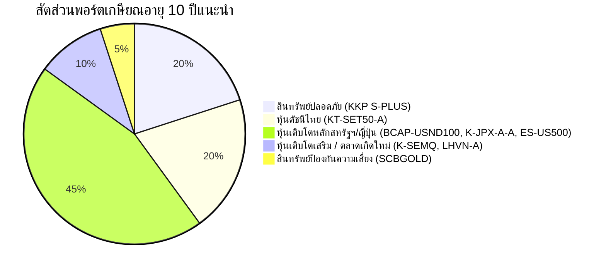

# แผนยุทธศาสตร์การลงทุนและวิเคราะห์กองทุนรวม (Investment Strategy for Funds)
*รายงานการวิเคราะห์และจัดอันดับกองทุนรวมเพื่อการวางแผนเกษียณอายุ (ระยะเวลาลงทุน 10 ปี)*  
**ข้อมูล ณ วันที่:** 11 กรกฎาคม พ.ศ. 2569

---

## 1. บทสรุปการจัดอันดับและหมวดหมู่การลงทุน (Summary Table)

ตารางสรุปการจัดอันดับดาวและความเหมาะสมในการลงทุนสำหรับนักลงทุนอายุ 50 ปี ที่ต้องการเกษียณอายุในอีก 10 ปี (พอร์ตสะสมมูลเพื่อการเกษียณ):

| สัญลักษณ์กองทุน | ระดับดาว (Rating) | คำแนะนำการลงทุน (Action) | สินทรัพย์อ้างอิงหลัก | ระดับความเสี่ยง | ค่าธรรมเนียมการจัดการ (เก็บจริง) |
| :--- | :---: | :---: | :--- | :---: | :---: |
| **[BCAP-USND100](file:///d:/Projects/Investing/BCAP-USND100/BCAP-USND100_Analysis_Report.md)** | ⭐⭐⭐⭐⭐ | **ควรซื้อ** (Core/Satellite Growth) | หุ้นสหรัฐฯ (Nasdaq-100) | 6 | 0.321% |
| **[K-JPX-A(A)](file:///d:/Projects/Investing/K-JPX-A-A/K-JPX-A-A_Analysis.md)** | ⭐⭐⭐⭐⭐ | **ควรซื้อ** (Core/Satellite Growth) | หุ้นญี่ปุ่น (TOPIX) | 6 | 0.313% |
| **[KT-SET50-A](file:///d:/Projects/Investing/KT-SET50-A/KT-SET50-A_Analysis.md)** | ⭐⭐⭐⭐ | **ควรซื้อ** (Core Thai Equity) | หุ้นไทยขนาดใหญ่ (SET50) | 6 | 0.428% |
| **[KKP S-PLUS](file:///d:/Projects/Investing/KKP_S_PLUS/kkp_s_plus_analysis.md)** | ⭐⭐⭐⭐ | **ควรซื้อ** (Safe Asset / Cash Park) | ตราสารหนี้ระยะสั้นไทย | 4 | ~0.29% |
| **[ES-US500](file:///d:/Projects/Investing/ES-US500/ES-US500_Analysis.md)** | ⭐⭐⭐⭐ | **ซื้อได้** (Core Global Equity) | หุ้นสหรัฐฯ (S&P 500) | 6 | 1.07% |
| **[K-SEMQ](file:///d:/Projects/Investing/K-SEMQ/K-SEMQ_Analysis.md)** | ⭐⭐⭐⭐ | **ซื้อได้** (Satellite Growth) | หุ้นตลาดเกิดใหม่ (Active EM) | 6 | 1.28% - 1.60% |
| **[SCBGOLD](file:///d:/Projects/Investing/SCBGOLD/SCBGOLD_Analysis.md)** | ⭐⭐⭐ | **ซื้อได้** (Diversifier / Safe Haven) | ทองคำแท่ง (SPDR Gold) | 8 | 0.535% |
| **[LHVN-A](file:///d:/Projects/Investing/LHVN-A/LHVN-A_Analysis.md)** | ⭐⭐⭐ | **ซื้อได้** (Satellite Growth) | หุ้นเวียดนาม (Fund of Funds) | 6 | 1.605% |
| **[B-CNNEXT](file:///d:/Projects/Investing/B-CNNEXT/B-CNNEXT_Analysis.md)** | ⭐⭐⭐ | **รอ** (Wait / Hold) | หุ้นจีนแผ่นดินใหญ่ A-Shares | 6 | ไม่ระบุในไฟล์วิเคราะห์ |
| **[BCAP-CTECH](file:///d:/Projects/Investing/BCAP-CTECH/BCAP-CTECH_Analysis.md)** | ⭐⭐⭐ | **รอ** (Wait / Hold) | เทคโนโลยีจีน (CQQQ & KWEB) | 6 | ไม่ระบุในไฟล์วิเคราะห์ |
| **[BTK](file:///d:/Projects/Investing/BTK/BTK_Analysis.md)** | ⭐⭐⭐ | **รอ** (Wait / Hold) | หุ้นไทยรายกลุ่ม (Bank & ICT) | 6 | 1.605% |
| **[K-INDX](file:///d:/Projects/Investing/K-INDX/K-INDX_Analysis.md)** | ⭐⭐⭐ | **รอ** (Wait / Hold) | หุ้นอินเดีย (MSCI India) | 6 | ~0.54% |
| **[BCAP-USL](file:///d:/Projects/Investing/BCAP-US/BCAP-USL_Analysis_Report.md)** | ⭐⭐⭐ | **รอ** (Wait / Hold) | ตราสารตลาดเงินสหรัฐฯ (USD) | 4 | 0.428% |

---

## 2. รายละเอียดการวิเคราะห์กองทุนรายกอง (Individual Fund Analysis)

### 2.1 กลุ่มระดับความน่าสนใจ 5 ดาว (⭐⭐⭐⭐⭐ - ควรซื้อ)

#### [BCAP-USND100 (กองทุนเปิดบีแคป หุ้นยูเอส เอ็นดี 100)](file:///d:/Projects/Investing/BCAP-USND100/BCAP-USND100_Analysis_Report.md)
*   **นโยบายการลงทุน:** ลงทุนเชิงรับ (Passive) อิงดัชนี Nasdaq-100 ผ่านกองทุนหลัก **Invesco NASDAQ 100 ETF (QQQM)** โดยไม่ป้องกันความเสี่ยงอัตราแลกเปลี่ยนแบบเต็มจำนวน (ตามดุลยพินิจ)
*   **Benchmark:** ดัชนี NASDAQ-100
*   **ระดับความเสี่ยง:** ระดับ 6 (เสี่ยงสูง)
*   **ค่าธรรมเนียมล่าสุด:** Management Fee เก็บจริง 0.321% ต่อปี, Expense Ratio ~0.452% ต่อปี, Front-end 0.16%, Back-end 0%
*   **AUM:** ~2,143.05 ล้านบาท
*   **ผลตอบแทนย้อนหลัง 1 / 3 / 5 ปี (ต่อปี):** 1 ปี: +37.83% | 3 ปี: +24.36% | 5 ปี: +14.11%
*   **Morningstar Rating:** ไม่มีระบุในรายงาน
*   **ผู้จัดการกองทุน:** บลจ. บางกอกแคปปิตอล (BCAP)
*   **ความเหมาะสมสำหรับ DCA:** เหมาะสมอย่างยิ่ง (Highly Recommended) ในฐานะเครื่องยนต์เร่งการเติบโต (Growth Engine) สัดส่วน 10-15% ของพอร์ต
*   **จุดแข็ง:**
    1. เกาะกระแสหุ้นเทคโนโลยีและนวัตกรรมชั้นนำระดับโลกที่มีคูเมืองแข็งแกร่ง (NVIDIA, Apple, Microsoft, Amazon, Alphabet)
    2. ค่าธรรมเนียมต่ำมากเมื่อเทียบกับกองทุนเทคโนโลยีแบบ Active ในไทย
    3. กองทุนหลัก QQQM มีสภาพคล่องและเสถียรภาพสูงมาก
*   **จุดอ่อน:**
    1. กระจุกตัวในกลุ่มอุตสาหกรรมเทคโนโลยีสารสนเทศสูงมาก (Sector Concentration)
    2. มีความผันผวนสูง (Beta > 1.0)
    3. มีความเสี่ยง FX จากการไม่มีนโยบายป้องกันความเสี่ยง 100%
*   **ยังน่าถือหรือควรเปลี่ยน:** **น่าถือต่ออย่างยิ่ง** ในฐานะตัวสร้างผลตอบแทนหลักของพอร์ตหุ้นต่างประเทศระยะยาว

#### [K-JPX-A(A) (กองทุนเปิดเค ดัชนีหุ้นญี่ปุ่น-A ชนิดสะสมมูลค่า)](file:///d:/Projects/Investing/K-JPX-A-A/K-JPX-A-A_Analysis.md)
*   **นโยบายการลงทุน:** ลงทุนเชิงรับ (Passive) อิงดัชนี TOPIX ผ่านกองทุนหลัก **NEXT FUNDS TOPIX ETF (1306)** ป้องกันความเสี่ยง FX ไม่น้อยกว่า 75% (Dynamic Hedging)
*   **Benchmark:** TOPIX (Tokyo Stock Price Index)
*   **ระดับความเสี่ยง:** ระดับ 6 (เสี่ยงสูง)
*   **ค่าธรรมเนียมล่าสุด:** Management Fee ~0.313% ต่อปี, Total Expense Ratio ~1.8723% ต่อปี, Front-end/Back-end ยกเว้น (0%)
*   **AUM:** ไม่ระบุในไฟล์วิเคราะห์
*   **ผลตอบแทนย้อนหลัง 1 / 3 / 5 ปี (ต่อปี):** 1 ปี: +39.36% | 3 ปี: +21.68% | 5 ปี: +16.52%
*   **Morningstar Rating:** **5 ดาว (5 Stars)** (ในกลุ่ม Japan Equity)
*   **ผู้จัดการกองทุน:** บลจ. กสิกรไทย (KAsset)
*   **ความเหมาะสมสำหรับ DCA:** เหมาะสมอย่างยิ่ง (Highly Recommended) สำหรับกระจายความเสี่ยงไปยังตลาดหุ้นพัฒนาแล้วนอกเหนือจากสหรัฐฯ ในสัดส่วน 10-15% ของพอร์ต
*   **จุดแข็ง:**
    1. ผลการดำเนินงานดีเยี่ยม (การันตีด้วย Morningstar 5 ดาว)
    2. ไม่มีค่าธรรมเนียมแรกเข้าและขาออก (0% Transaction Fees) เอื้อต่อการ DCA
    3. มีการป้องกันความเสี่ยงอัตราแลกเปลี่ยนที่ชัดเจน (>= 75%) ป้องกันผลกระทบเงินเยนผันผวน
    4. ได้รับปัจจัยบวกเชิงโครงสร้างจากการปรับปรุงบรรษัทภิบาล (Corporate Governance) ของญี่ปุ่น
*   **จุดอ่อน:**
    1. นโยบายการเงินของ BOJ มีแนวโน้มปรับขึ้นดอกเบี้ยซึ่งอาจสร้างความผันผวนในระยะสั้น
    2. ค่าใช้จ่ายรวมของโครงการค่อนข้างสูง (Total Expense ~1.87%)
*   **ยังน่าถือหรือควรเปลี่ยน:** **น่าถือต่ออย่างยิ่ง** เป็นกองทุนญี่ปุ่นที่ดีที่สุดสำหรับจัดพอร์ต

---

### 2.2 กลุ่มระดับความน่าสนใจ 4 ดาว (⭐⭐⭐⭐ - ควรซื้อ / ซื้อได้)

#### [KT-SET50-A (กองทุนเปิดกรุงไทย SET50 ชนิดสะสมมูลค่า)](file:///d:/Projects/Investing/KT-SET50-A/KT-SET50-A_Analysis.md) — **ควรซื้อ**
*   **นโยบายการลงทุน:** ลงทุนเชิงรับ (Passive) มุ่งเน้นสร้างผลตอบแทนตามดัชนีผลตอบแทนรวม SET50 (SET50 TRI) นำปันผลไปลงทุนทบต้นอัตโนมัติ
*   **Benchmark:** SET50 TRI 100%
*   **ระดับความเสี่ยง:** ระดับ 6 (เสี่ยงสูง)
*   **ค่าธรรมเนียมล่าสุด:** Management Fee เก็บจริง 0.428% ต่อปี, Total Expense Ratio เก็บจริง 0.493% ต่อปี, Front/Back-end ยกเว้น, Brokerage Fee 0.10%
*   **AUM:** ~4,139.48 ล้านบาท
*   **ผลตอบแทนย้อนหลัง 1 / 3 / 5 ปี (ต่อปี):** 1 ปี: +41.78% | 3 ปี: +6.87% | 5 ปี: +4.45%
*   **Morningstar Rating:** ไม่มีระบุในรายงาน
*   **ผู้จัดการกองทุน:** บลจ. กรุงไทย (KTAM)
*   **ความเหมาะสมสำหรับ DCA:** เหมาะสมอย่างยิ่ง (Highly Recommended) สำหรับเป็นแกนหลักหุ้นไทย (Core Thai Equity) สัดส่วน 15-25% ของพอร์ต
*   **จุดแข็ง:**
    1. ต้นทุนรวมต่ำมากเพียง 0.493% ต่อปี ป้องกันการดรอปของผลตอบแทนในระยะยาว
    2. มี Tracking Error ต่ำมาก (0.21%) สะท้อนการทำตามดัชนีที่มีประสิทธิภาพสูง
    3. ชนิดสะสมมูลค่า ไม่ต้องเสียภาษีเงินปันผลหัก ณ ที่จ่าย 10%
*   **จุดอ่อน:**
    1. ตลาดหุ้นไทยกระจุกตัวและได้รับผลกระทบจากเศรษฐกิจภายในประเทศที่เติบโตช้าลงเชิงโครงสร้าง
    2. ผลตอบแทนรวมแพ้ Benchmark เล็กน้อยเสมอตามโครงสร้างกองทุนดัชนี (Alpha ติดลบเล็กน้อย)
*   **ยังน่าถือหรือควรเปลี่ยน:** **น่าถือต่ออย่างยิ่ง** ในฐานะพอร์ตหลักหุ้นไทยที่ดีที่สุด ด้วยค่าธรรมเนียมที่ประหยัด

#### [KKP S-PLUS (กองทุนเปิดเคเคพี สมาร์ท พลัส)](file:///d:/Projects/Investing/KKP_S_PLUS/kkp_s_plus_analysis.md) — **ควรซื้อ (สำหรับพักเงินสด/ตราสารหนี้เสี่ยงต่ำ)**
*   **นโยบายการลงทุน:** ลงทุนตราสารหนี้ระยะสั้นคุณภาพดี (Investment Grade) อายุเฉลี่ยตราสารไม่เกิน 1 ปี ป้องกันความเสี่ยง FX เกือบทั้งหมด (Fully Hedged)
*   **Benchmark:** ดัชนีตราสารหนี้ระยะสั้นไทย
*   **ระดับความเสี่ยง:** ระดับ 4 (เสี่ยงปานกลางค่อนข้างต่ำ)
*   **ค่าธรรมเนียมล่าสุด:** Management Fee ~0.29% ต่อปี, Front/Back-end ยกเว้น (0%)
*   **AUM:** ไม่ระบุในไฟล์วิเคราะห์
*   **ผลตอบแทนย้อนหลัง 1 / 3 / 5 ปี (ต่อปี):** 1 ปี: +1.78% ถึง +2.01% | 3 ปี: +2.37% | 5 ปี: ไม่ระบุ
*   **Morningstar Rating:** ไม่มีระบุในรายงาน
*   **ผู้จัดการกองทุน:** บลจ. เกียรตินาคินภัทร (KKPAM)
*   **ความเหมาะสมสำหรับ DCA:** เหมาะสำหรับซื้อสะสมเพื่อเป็นสินทรัพย์ปลอดภัยในการรักษามูลค่าเงินต้น (Safe Assets) สัดส่วน 10-20% ของพอร์ต แต่ไม่เหมาะสำหรับการ DCA เพื่อหวังผลตอบแทนเติบโตเอาชนะเงินเฟ้อ
*   **จุดแข็ง:**
    1. ความผันผวนต่ำมาก รักษาเงินต้นได้ดีมาก (เหมาะอย่างยิ่งสำหรับนักลงทุนวัยใกล้เกษียณ)
    2. สภาพคล่องสูง ซื้อขายได้ทุกวันทำการ ปราศจากค่าธรรมเนียมเข้า-ออก
    3. ค่าธรรมเนียมการจัดการต่ำมากเพียง 0.29%
*   **จุดอ่อน:**
    1. ผลตอบแทนต่ำกว่าอัตราเงินเฟ้อระยะยาว (ประมาณ 1.8% - 2.4% ต่อปี) ไม่สามารถสร้างการเติบโตแบบก้าวกระโดดได้
    2. ไม่จ่ายเงินปันผล (ต้องสั่งขายหน่วยลงทุนหากต้องการเงินสด)
*   **ยังน่าถือหรือควรเปลี่ยน:** **น่าถือต่ออย่างยิ่ง** ในส่วนของเงินสำรองฉุกเฉินและพอร์ตเสี่ยงต่ำเพื่อพยุงมูลค่าพอร์ตรวมเมื่อใกล้เกษียณ

#### [ES-US500 (กองทุนเปิดอีสท์สปริง US500 Equity Index)](file:///d:/Projects/Investing/ES-US500/ES-US500_Analysis.md) — **ซื้อได้**
*   **นโยบายการลงทุน:** ลงทุนเชิงรับ (Passive) อิงดัชนี S&P 500 ผ่านกองทุนหลัก **iShares Core S&P 500 ETF (IVV)** ป้องกันความเสี่ยง FX ตามดุลยพินิจ (Discretionary Hedging)
*   **Benchmark:** S&P 500 Index
*   **ระดับความเสี่ยง:** ระดับ 6 (เสี่ยงสูง)
*   **ค่าธรรมเนียมล่าสุด:** Management Fee ~1.07% ต่อปี, Front-end Fee 1.00%, Back-end Fee ยกเว้น
*   **AUM:** ~3,396.99 ล้านบาท
*   **ผลตอบแทนย้อนหลัง 1 / 3 / 5 ปี (ต่อปี):** 1 ปี: ~17.18% | 3 ปี: ไม่ระบุ | 5 ปี: ไม่ระบุ
*   **Morningstar Rating:** **4 ดาว (4 Stars)** (ช่วงปี 2568-2569)
*   **ผู้จัดการกองทุน:** บลจ. อีสท์สปริง (Eastspring)
*   **ความเหมาะสมสำหรับ DCA:** เหมาะสมสำหรับการทำ DCA เพื่อเป็นหุ้นแกนหลักต่างประเทศ (Core Global/US Equity) สัดส่วน 15-25% ของพอร์ต
*   **จุดแข็ง:**
    1. กระจายการลงทุนในบริษัทชั้นนำของโลก 500 แห่งของสหรัฐฯ ครอบคลุมหลายภาคเศรษฐกิจที่ขับเคลื่อนโลก
    2. ได้รับ 4 ดาวจาก Morningstar ยืนยันคุณภาพ
    3. ซื้อขั้นต่ำเริ่มต้นเพียง 1 บาท เหมาะกับผู้เริ่มต้นลงทุน
*   **จุดอ่อน:**
    1. ค่าธรรมเนียมการจัดการ (1.07%) และ Front-end (1.00%) ถือว่าค่อนข้างสูงเมื่อเทียบกับกองทุนรวมดัชนี S&P 500 กองอื่นในอุตสาหกรรมในไทย
    2. มีความเสี่ยงอัตราแลกเปลี่ยนจากการใช้ดุลยพินิจของผู้จัดการกองทุน
    3. เริ่มกระจุกตัวในกลุ่ม Big Tech สหรัฐฯ มากขึ้น
*   **ยังน่าถือหรือควรเปลี่ยน:** **น่าถือต่อ** แต่สำหรับนักลงทุนที่ต้องการลดต้นทุนค่าใช้จ่ายสะสมระยะยาว 10 ปี สามารถพิจารณาเปรียบเทียบหรือสับเปลี่ยนไปยังกองดัชนี S&P 500 ค่ายอื่นที่มีค่าธรรมเนียมการจัดการต่ำกว่าได้

#### [K-SEMQ (กองทุนเปิดเค ซีเล็คทีฟ อีเมอร์จิ้ง มาร์เก็ตส์ หุ้นทุน)](file:///d:/Projects/Investing/K-SEMQ/K-SEMQ_Analysis.md) — **ซื้อได้**
*   **นโยบายการลงทุน:** ลงทุนเชิงรุก (Active) ในหุ้นเติบโตตลาดเกิดใหม่ผ่านกองทุนหลัก **Templeton Emerging Markets Fund, Class I (acc) USD** ป้องกันความเสี่ยง FX ไม่น้อยกว่า 75%
*   **Benchmark:** MSCI Emerging Markets Index (อ้างอิงข้อมูลดัชนีตลาดเกิดใหม่หลัก)
*   **ระดับความเสี่ยง:** ระดับ 6 (เสี่ยงสูง)
*   **ค่าธรรมเนียมล่าสุด:** Management Fee ประมาณ 1.28% - 1.60% ต่อปี, Front-end 1.50%, Back-end 0%
*   **AUM:** ~5,100 - 5,300 ล้านบาท
*   **ผลตอบแทนย้อนหลัง 1 / 3 / 5 ปี (ต่อปี):** 1 ปี: +66.53% | 3 ปี: +25.50% (เฉลี่ยปีต่อปี) | 5 ปี: ไม่ระบุ
*   **Morningstar Rating:** ไม่มีระบุในรายงาน
*   **ผู้จัดการกองทุน:** บลจ. กสิกรไทย (KAsset) ร่วมกับ Franklin Templeton
*   **ความเหมาะสมสำหรับ DCA:** เหมาะสำหรับ DCA เป็นพอร์ตเติบโตเสริม (Satellite Portfolio) สัดส่วนไม่เกิน 5-10% ของพอร์ต
*   **จุดแข็ง:**
    1. ได้ประโยชน์โดยตรงจากหุ้นเซมิคอนดักเตอร์และฮาร์ดแวร์ AI ผู้นำโลก (SK Hynix, TSMC, Samsung) ซึ่งรวมกันเกือบ 30% ของพอร์ต
    2. ผลตอบแทนย้อนหลังระยะ 1 ปีสูงและโดดเด่นมาก (+66.53%)
    3. บริหารแบบ Active โดยทีมผู้เชี่ยวชาญระดับโลก
*   **จุดอ่อน:**
    1. กระจุกตัวในหุ้นขนาดใหญ่ 3 ตัวแรกค่อนข้างสูง หากกลุ่มเทคโนโลยี/ชิปเข้าสู่ช่วงขาลง (Down cycle) จะได้รับผลกระทบรุนแรง
    2. มีค่าธรรมเนียม Front-end 1.50% และ Management Fee ค่อนข้างแพง
    3. ความเสี่ยงทางภูมิรัฐศาสตร์สูงมาก (โดยเฉพาะประเด็นจีน-ไต้หวัน)
*   **ยังน่าถือหรือควรเปลี่ยน:** **น่าถือต่อ** เป็นตัวเร่งการเติบโตที่ดีสำหรับพอร์ต แต่ต้องบริหารความเสี่ยงให้อยู่ในสัดส่วนที่ต่ำตามคำแนะนำ

---

### 2.3 กลุ่มระดับความน่าสนใจ 3 ดาว (⭐⭐⭐ - ซื้อได้ / รอ)

#### [SCBGOLD (กองทุนเปิดไทยพาณิชย์โกลด์ ชนิดสะสมมูลค่า)](file:///d:/Projects/Investing/SCBGOLD/SCBGOLD_Analysis.md) — **ซื้อได้ (สำหรับกระจายความเสี่ยงพอร์ต)**
*   **นโยบายการลงทุน:** ลงทุนเชิงรับอิงราคาทองคำแท่งในตลาดโลกผ่านกองทุนหลัก **SPDR Gold Trust** โดยไม่มีการป้องกันความเสี่ยงอัตราแลกเปลี่ยน (Unhedged)
*   **Benchmark:** LBMA Gold Price PM ปรับด้วยอัตราแลกเปลี่ยนเงินบาท
*   **ระดับความเสี่ยง:** ระดับ 8 (เสี่ยงสูงมาก / สินทรัพย์ทางเลือก)
*   **ค่าธรรมเนียมล่าสุด:** Management Fee 0.5350% ต่อปี, Front-end Fee 0.50%
*   **AUM:** ~7,258 ล้านบาท
*   **ผลตอบแทนย้อนหลัง 1 / 3 / 5 ปี:** ไม่ระบุในรายงานวิเคราะห์
*   **Morningstar Rating:** ไม่มีระบุในรายงาน
*   **ผู้จัดการกองทุน:** บลจ. ไทยพาณิชย์ (SCBAM)
*   **ความเหมาะสมสำหรับ DCA:** เหมาะสำหรับ DCA สะสมเป็นสินทรัพย์ป้องกันความเสี่ยงจากวิกฤตเศรษฐกิจและเงินเฟ้อ (Safe Haven) สัดส่วน 5-10% ของพอร์ต
*   **จุดแข็ง:**
    1. เริ่มต้นสะสมได้ง่ายด้วยเงินเพียง 1 บาท ได้สัดส่วนทองคำแท่งมาตรฐานโลก
    2. สอดรับกับสภาวะวิกฤตและช่วงตลาดหุ้นขาลงได้ดีมาก (Low Correlation กับสินทรัพย์ทางการเงินอื่น)
    3. สภาพคล่องดีเยี่ยมผ่านขนาดกองทุนขนาดใหญ่
*   **จุดอ่อน:**
    1. ปราศจากการป้องกันความเสี่ยง FX (Unhedged 100%) ทำให้ผลตอบแทนผันผวนตามทิศทางค่าเงินบาท-ดอลลาร์เป็นหลัก
    2. ไม่มีปันผลหรือดอกเบี้ย ผลตอบแทนเกิดจาก Capital Gain ล้วน ๆ
    3. ระดับความเสี่ยงสูงสุด (ระดับ 8)
*   **ยังน่าถือหรือควรเปลี่ยน:** **น่าถือต่อเพื่อการกระจายความเสี่ยง** แต่หากนักลงทุนไม่ต้องการรับความเสี่ยงจากอัตราแลกเปลี่ยน (บาทแข็งค่า) ควรพิจารณาเปลี่ยนไปซื้อกองทุน **SCBGOLDH** (คลาสป้องกันความเสี่ยง FX) แทน

#### [LHVN-A (กองทุนเปิด แอล เอช เวียดนาม ชนิดสะสมมูลค่า)](file:///d:/Projects/Investing/LHVN-A/LHVN-A_Analysis.md) — **ซื้อได้ (สัดส่วนน้อย)**
*   **นโยบายการลงทุน:** ลงทุนสไตล์ Fund of Funds ในหุ้นเวียดนามที่มีศักยภาพสูง ผ่านผู้จัดการกองทุนเชิงรุก (VinaCapital, Lumen, Dragon Capital) และเชิงรับ (VN30, VNFIN LEAD) เพื่อมุ่งทำผลงานชนะดัชนี (Active Management) ป้องกันความเสี่ยง FX ตามดุลยพินิจ
*   **Benchmark:** ดัชนี VN Index (แปลงเป็นเงินบาท)
*   **ระดับความเสี่ยง:** ระดับ 6 (เสี่ยงสูง)
*   **ค่าธรรมเนียมล่าสุด:** Management Fee 1.605% ต่อปี, Front-end Fee 1.50%
*   **AUM:** ไม่ระบุในไฟล์วิเคราะห์
*   **ผลตอบแทนย้อนหลัง 1 / 3 / 5 ปี:** ไม่ระบุในไฟล์วิเคราะห์
*   **Morningstar Rating:** ไม่มีระบุในรายงาน
*   **ผู้จัดการกองทุน:** บลจ. แลนด์ แอนด์ เฮ้าส์ (LH Fund)
*   **ความเหมาะสมสำหรับ DCA:** ทยอยลงทุนแบบ DCA ได้ในสัดส่วนพอร์ตเสริมขนาดเล็ก (Satellite Portfolio) **ไม่เกิน 5% ของพอร์ต**
*   **จุดแข็ง:**
    1. กระจายสไตล์การลงทุนแบบ Multi-Manager ทั้งเชิงรุกและเชิงรับ ช่วยลดการกระจุกตัวในการเลือกผู้จัดการกองทุนรายใดรายหนึ่ง
    2. เศรษฐกิจเวียดนามมีพื้นฐานระยะยาวที่เติบโตได้ดีจากการดึงดูดทุนต่างชาติ (FDI) และโครงสร้างประชากรคนรุ่นใหม่
*   **จุดอ่อน:**
    1. ตลาดหุ้นเวียดนามจัดอยู่ในกลุ่ม Frontier Market ซึ่งมีข้อจำกัดเรื่องสภาพคล่อง กฎระเบียบที่ผันแปร และความเสี่ยงเชิงโครงสร้างประเทศเดี่ยว
    2. ค่าธรรมเนียมจัดเก็บในระดับค่อนข้างสูง (ทั้งการจัดการและค่าธรรมเนียมแรกเข้า)
*   **ยังน่าถือหรือควรเปลี่ยน:** **น่าถือต่อสำหรับการแสวงหาผลตอบแทนเติบโตเสริม** แต่ต้องมั่นใจว่าพอร์ตหลักมีความเสถียรแล้ว และควรจำกัดสัดส่วนไว้ต่ำมากเนื่องจากวัยใกล้เกษียณ

#### [B-CNNEXT (กองทุนเปิดบัวหลวง China Next Economy)](file:///d:/Projects/Investing/B-CNNEXT/B-CNNEXT_Analysis.md) — **รอ (Wait / Hold)**
*   **นโยบายการลงทุน:** ลงทุนเชิงรุกผ่าน Fund of Funds ในหุ้นนวัตกรรมจีนแผ่นดินใหญ่ (China A-Shares) เช่น พลังงานสะอาด, EV, เทคโนโลยีความมั่นคง และเซมิคอนดักเตอร์ ร่วมมือกับ E Fund Management ป้องกันความเสี่ยง FX ตามดุลยพินิจ
*   **Benchmark:** ไม่ระบุในไฟล์วิเคราะห์
*   **ระดับความเสี่ยง:** ระดับ 6 (เสี่ยงสูง)
*   **ค่าธรรมเนียมล่าสุด:** ไม่ระบุในไฟล์วิเคราะห์
*   **AUM:** ไม่ระบุในไฟล์วิเคราะห์
*   **ผลตอบแทนย้อนหลัง 1 / 3 / 5 ปี:** ไม่ระบุในไฟล์วิเคราะห์ (มีข้อมูล YTD ปี 2569: +42.94% ถึง +65.45%)
*   **Morningstar Rating:** ไม่มีระบุในรายงาน
*   **ผู้จัดการกองทุน:** บลจ. บัวหลวง (BBLAM) ร่วมกับ E Fund Management
*   **ความเหมาะสมสำหรับ DCA:** ซื้อเฉลี่ยแบบ DCA ได้เฉพาะในสัดส่วนพอร์ตดาวเทียมขนาดเล็กมาก (Satellite Portfolio) ไม่เกิน 3-5% ของพอร์ต
*   **จุดแข็ง:**
    1. เข้าถึงหุ้นกลุ่มเทคโนโลยีเชิงนวัตกรรมระดับก้าวหน้าในประเทศจีน (Onshore China A-Shares) ที่คัดเลือกโดยพันธมิตรท้องถิ่นชั้นนำ (E Fund)
    2. ได้ประโยชน์จากกระแสนโยบายกระตุ้นเศรษฐกิจและการสนับสนุนอุตสาหกรรมในประเทศของรัฐบาลจีน สะท้อนในผลตอบแทนปีปัจจุบันที่ฟื้นตัวร้อนแรง
*   **จุดอ่อน:**
    1. ความผันผวนของหุ้นจีน A-shares กลุ่มนวัตกรรมจัดเป็นหนึ่งในอุตสาหกรรมที่ผันผวนสูงที่สุดในโลก
    2. ความเสี่ยงเชิงนโยบายและมาตรการจัดระเบียบของรัฐบาลจีน รวมถึงไม่มีการจ่ายเงินปันผล
*   **ยังน่าถือหรือควรเปลี่ยน:** **แนะนำให้ "รอชะลอการซื้อเพิ่ม"** หรือหากถืออยู่ให้จำกัดสัดส่วนให้แคบ หากพอร์ตมีหุ้นจีนมากเกินไปควรพิจารณาลดสัดส่วนเพื่อควบคุมความผันผวนในวัยใกล้เกษียณ

#### [BCAP-CTECH (กองทุนเปิดบีแคป ไชน่า เทคโนโลยี)](file:///d:/Projects/Investing/BCAP-CTECH/BCAP-CTECH_Analysis.md) — **รอ (Wait / Hold)**
*   **นโยบายการลงทุน:** ลงทุน Fund of Funds สัดส่วน ~50/50 ในกองทุน ETF จีน ได้แก่ **Invesco China Technology ETF (CQQQ)** และ **KraneShares CSI China Internet ETF (KWEB)** ป้องกันความเสี่ยง FX ไม่น้อยกว่า 80%
*   **Benchmark:** ไม่ระบุในไฟล์วิเคราะห์
*   **ระดับความเสี่ยง:** ระดับ 6 (เสี่ยงสูง)
*   **ค่าธรรมเนียมล่าสุด:** ไม่ระบุในไฟล์วิเคราะห์
*   **AUM:** ไม่ระบุในไฟล์วิเคราะห์
*   **ผลตอบแทนย้อนหลัง 1 / 3 / 5 ปี (ต่อปี):** YTD: -14% ถึง -15% | 1 ปี: -5.34% ถึง -5.40% | 3 ปี: +1.91% ถึง +4.41%
*   **Morningstar Rating:** ไม่มีระบุในรายงาน
*   **ผู้จัดการกองทุน:** บลจ. บางกอกแคปปิตอล (BCAP)
*   **ความเหมาะสมสำหรับ DCA:** ทยอยสะสม DCA เป็นสัดส่วนเสริมขนาดเล็ก (5-10% ของพอร์ต) เพื่อลดผลกระทบจากการปรับฐาน
*   **จุดแข็ง:**
    1. ป้องกันความเสี่ยงอัตราแลกเปลี่ยนสูง (>80%) ช่วยควบคุมความผันผวนด้านค่าเงิน
    2. กระจายตัวได้ดีทั้งฝั่งฮาร์ดแวร์เซมิคอนดักเตอร์ (CQQQ) และแพลตฟอร์มอินเทอร์เน็ตอีคอมเมิร์ซ (KWEB)
*   **จุดอ่อน:**
    1. ประสิทธิภาพการดำเนินงานระยะ 1 ปีที่ผ่านมาและปีล่าสุดย่ำแย่และติดลบอย่างต่อเนื่อง
    2. ความเสี่ยงด้านภูมิรัฐศาสตร์ (การกีดกันเทคโนโลยีชิปจากสหรัฐฯ และความเสี่ยงในการถูกเพิกถอนจากตลาดสหรัฐฯ - Delisting Risk) และมาตรการจัดระเบียบของจีนในอดีตยังคอยกดดันราคา
*   **ยังน่าถือหรือควรเปลี่ยน:** **แนะนำให้ "รอเพื่อรอดูสถานการณ์"** หรือสับเปลี่ยนเงินทุนบางส่วนไปสะสมในกองทุนเทคโนโลยีที่มีความเสถียรและเติบโตชัดเจนกว่า เช่น BCAP-USND100 หากผลการดำเนินงานยังคงติดลบต่อเนื่อง

#### [BTK (กองทุนเปิดบัวหลวงธนคม)](file:///d:/Projects/Investing/BTK/BTK_Analysis.md) — **รอ (Wait / Hold)**
*   **นโยบายการลงทุน:** เน้นลงทุนในหุ้นไทยโดยกระจุกตัวใน 3 กลุ่มอุตสาหกรรมหลัก ได้แก่ กลุ่มธนาคาร, กลุ่มเงินทุนและหลักทรัพย์ และกลุ่มสื่อสาร ไม่น้อยกว่า 80% ของ NAV
*   **Benchmark:** BANK TRI 50% / ICT TRI 40% / FIN TRI 10%
*   **ระดับความเสี่ยง:** ระดับ 6 (เสี่ยงสูง)
*   **ค่าธรรมเนียมล่าสุด:** Management Fee เก็บจริง 1.605% ต่อปี, Total Expense Ratio 1.791% ต่อปี, Front/Back-end ยกเว้น (0%)
*   **AUM:** ~594.86 ล้านบาท (ณ ส.ค. 2568)
*   **ผลตอบแทนย้อนหลัง 1 / 3 / 5 ปี:** 1 ปี: +40.93% | 3 ปี: ไม่ระบุ | 5 ปี: ไม่ระบุ
*   **Morningstar Rating:** ไม่มีจัดอันดับดาว
*   **ผู้จัดการกองทุน:** บลจ. บัวหลวง (BBLAM)
*   **ความเหมาะสมสำหรับ DCA:** DCA ได้ปานกลาง แต่จำเป็นต้องระวังเรื่องการกระจุกตัวของอุตสาหกรรม (Sector Concentration)
*   **จุดแข็ง:**
    1. หุ้นที่เป็นส่วนประกอบส่วนใหญ่เป็นบริษัทขนาดใหญ่ที่มีฐานะแข็งแกร่ง (ADVANC, SCB, KBANK) และจ่ายปันผลสม่ำเสมอ
    2. นโยบายสะสมมูลค่าช่วยให้ปันผลถูกทบต้นโดยไม่ต้องหักภาษี 10%
    3. ฟรีค่าธรรมเนียมแรกเข้า
*   **จุดอ่อน:**
    1. การกระจุกตัวเพียง 3 กลุ่มอุตสาหกรรม หากเกิดวิกฤตกับกลุ่มธนาคารหรือกลุ่มสื่อสารจะทำลาย NAV ของกองทุนได้อย่างรวดเร็ว ต่างจากกองทุนที่อิง SET50
    2. ค่าธรรมเนียมการจัดการสูงถึง 1.605% ต่อปี (ถือว่าแพงมากเมื่อเทียบกับกองทุนเชิงรับอย่าง KT-SET50-A)
*   **ยังน่าถือหรือควรเปลี่ยน:** **แนะนำให้ "เปลี่ยน (Switch)"** หรือลดน้ำหนักลงทุนเพื่อย้ายไปยังกองทุนรวมดัชนีตลาดหุ้นไทยที่มีความหลากหลายและค่าธรรมเนียมถูกกว่าอย่าง **KT-SET50-A** ซึ่งจะช่วยประหยัดค่าใช้จ่ายการบริหารไปได้ถึงปีละกว่า 1.2% และกระจายความเสี่ยงได้กว้างกว่า

#### [K-INDX (กองทุนเปิดเค ดัชนีหุ้นอินเดีย)](file:///d:/Projects/Investing/K-INDX/K-INDX_Analysis.md) — **รอ (Wait / Hold)**
*   **นโยบายการลงทุน:** ลงทุนเชิงรับ (Passive) อิงดัชนี MSCI India Net TR (USD) ผ่านกองทุนหลัก **iShares MSCI India UCITS ETF (NDIA)** ป้องกันความเสี่ยง FX ตามดุลยพินิจ
*   **Benchmark:** MSCI Emerging Markets India Net TR (USD)
*   **ระดับความเสี่ยง:** ระดับ 6 (เสี่ยงสูง)
*   **ค่าธรรมเนียมล่าสุด:** Management Fee ~0.54% ต่อปี, Front-end ยกเว้น (0%), Back-end 0.15%
*   **AUM:** ไม่ระบุในไฟล์วิเคราะห์
*   **ผลตอบแทนย้อนหลัง 1 / 3 / 5 ปี (ต่อปี):** 1 ปี: -14.77% | 3 ปี: -0.49% | 5 ปี: -0.42%
*   **Morningstar Rating:** ไม่มีระบุในรายงาน
*   **ผู้จัดการกองทุน:** บลจ. กสิกรไทย (KAsset)
*   **ความเหมาะสมสำหรับ DCA:** ซื้อเฉลี่ย DCA ได้ยากเนื่องจากภาพรวมผลตอบแทนย้อนหลังยังคงมีแนวโน้มติดลบ แนะนำจำกัดสัดส่วนไม่เกิน 5%
*   **จุดแข็ง:**
    1. ค่าธรรมเนียมค่อนข้างต่ำและไม่มีค่าธรรมเนียมแรกเข้า ทำให้บริหารต้นทุนการสะสมได้ง่าย
    2. ศักยภาพการเติบโตเชิงโครงสร้างของอินเดียจากการเพิ่มขึ้นของประชากรและกลุ่มชนชั้นกลางเป็นแรงผลักดันที่ดีในระยะยาว
*   **จุดอ่อน:**
    1. ผลตอบแทนย้อนหลัง 1 ปี (-14.77%) รวมถึง 3 ปี และ 5 ปี อยู่ในระดับย่ำแย่และติดลบชั่วคราว
    2. มีการกระจุกตัวในกลุ่มการเงินและพลังงานสูง
    3. ความเสี่ยงด้าน FX เนื่องจากป้องกันความเสี่ยงตามดุลยพินิจและมีผลกระทบจากค่าเงินรูปี
*   **ยังน่าถือหรือควรเปลี่ยน:** **แนะนำให้ "รอเพื่อการฟื้นตัว"** หรือหากต้องการเติบโตในระยะ 10 ปี แนะนำสับเปลี่ยนน้ำหนักไปยังภูมิภาคที่เติบโตมีประสิทธิภาพสูงกว่า เช่น สหรัฐฯ หรือญี่ปุ่นที่มีประวัติความสามารถในการทำกำไรที่ชัดเจนกว่า

#### [BCAP-USL (กองทุนเปิดบีแคป ยูเอสดี ชอร์ทเทอม ลิควิดิตี้)](file:///d:/Projects/Investing/BCAP-US/BCAP-USL_Analysis_Report.md) — **รอ (Wait / Hold)**
*   **นโยบายการลงทุน:** ลงทุนในกองทุนตราสารหนี้ระยะสั้นคุณภาพสูงสกุลดอลลาร์สหรัฐ **Pictet - Short-Term Money Market USD** โดย **ไม่มีการป้องกันความเสี่ยงอัตราแลกเปลี่ยน (Unhedged 100%)**
*   **Benchmark:** ผลตอบแทนตลาดเงินสกุลดอลลาร์สหรัฐ (USD Money Market)
*   **ระดับความเสี่ยง:** ระดับ 4 (เสี่ยงปานกลางค่อนข้างต่ำ)
*   **ค่าธรรมเนียมล่าสุด:** Management Fee เก็บจริง 0.428% ต่อปี, Trustee 0.0268%, Registrar 0.0696%, Front/Back-end ยกเว้น
*   **AUM:** ~2,098.71 ล้านบาท
*   **ผลตอบแทนย้อนหลัง 1 / 3 / 5 ปี:** ไม่ระบุ (จัดตั้งเมื่อ ธ.ค. 2566)
*   **Morningstar Rating:** ไม่มีระบุในรายงาน
*   **ผู้จัดการกองทุน:** บลจ. บางกอกแคปปิตอล (BCAP)
*   **ความเหมาะสมสำหรับ DCA:** ไม่แนะนำสำหรับ DCA เพื่อสะสมความเติบโตระยะยาว แต่เหมาะใช้พักเงินในรูปดอลลาร์ระยะสั้นชั่วคราว
*   **จุดแข็ง:**
    1. ตราสารหนี้ต่างประเทศเครดิตดีมาก โอกาส Default เกือบเป็นศูนย์
    2. สภาพคล่องสูง (T+2) และได้รับผลตอบแทนสอดคล้องกับดอกเบี้ยตลาดสหรัฐฯ
*   **จุดอ่อน:**
    1. ไม่มีการป้องกันความเสี่ยงค่าเงิน (Unhedged 100%) ทำให้ราคา NAV ในรูปบาทผันผวนอย่างรุนแรงตามอัตราแลกเปลี่ยน USD/THB (ไม่สอดคล้องกับลักษณะกองทุนพักเงิน)
    2. แนวโน้มอัตราดอกเบี้ยขาลงของธนาคารกลางสหรัฐฯ (Fed) จะทำให้ Yield ของกองทุนปรับลดลง
*   **ยังน่าถือหรือควรเปลี่ยน:** **แนะนำให้ "รอและเปลี่ยน (Switch)"** หากพอร์ตเกษียณไม่ต้องการถือครองดอลลาร์สหรัฐเพื่อวัตถุประสงค์เฉพาะตัว แนะนำให้เปลี่ยนมาพักเงินในตราสารหนี้ระยะสั้นไทยอย่าง **KKP S-PLUS** เพื่อป้องกันการสูญเสียเงินต้นจากการแข็งค่าของเงินบาท

---

## 3. คำแนะนำการจัดพอร์ตลงทุนเพื่อการเกษียณอายุ (Asset Allocation Guide)
สำหรับผู้ลงทุน **อายุ 50 ปี** ที่ตั้งเป้าหมาย **เกษียณในอีก 10 ปี (อายุ 60 ปี)**:

### 3.1 การกระจายพอร์ตการลงทุนที่แนะนำ (Target Portfolio Allocation)
ในวัย 50 ปี เป้าหมายหลักคือการรักษาสมดุลระหว่าง "การเติบโตเพื่อเอาชนะเงินเฟ้อ" และ "การปกป้องเงินต้นเพื่อป้องกันตลาดผันผวนก่อนเกษียณ"

1.  **สินทรัพย์ปลอดภัย / พักเงิน (20%):** แนะนำจัดสรรใน **KKP S-PLUS** เพื่อเป็นฐานความมั่นคง รักษาสภาพคล่อง และหลีกเลี่ยงการใช้กองทุน Unhedged อย่าง BCAP-USL ในสัดส่วนสูง
2.  **หุ้นไทยพอร์ตหลัก (20%):** แนะนำจัดสรรใน **KT-SET50-A** เนื่องจากประหยัดต้นทุนสะสมและได้สิทธิ์ผลประโยชน์จากการทบต้นโดยตรง หลีกเลี่ยงหรือสับเปลี่ยนจาก BTK เพื่อลดการกระจุกตัวในกลุ่มอุตสาหกรรม
3.  **หุ้นพัฒนาแล้วพอร์ตหลักต่างประเทศ (45%):** เน้นความแข็งแกร่งของเทคโนโลยีและประสิทธิภาพสูงผ่าน **BCAP-USND100** และกระจายเข้าหาเอเชียพัฒนาแล้วผ่าน **K-JPX-A(A)** ควบคู่ไปกับ **ES-US500**
4.  **หุ้นเติบโตเสริม / ดาวเทียม (10%):** จัดสรรใน **K-SEMQ** เพื่อเสริมพลังเทคโนโลยีระดับโลก หรือ **LHVN-A** สำหรับเพิ่ม Upside จากตลาด Frontier Market (หลีกเลี่ยงการถือ B-CNNEXT หรือ K-INDX ในปริมาณมาก)
5.  **สินทรัพย์ทางเลือกป้องกันความเสี่ยง (5%):** จัดสรรใน **SCBGOLD** (หรือแนะนำเพิ่มรุ่น Hedged เช่น SCBGOLDH) เพื่อพยุงความเสี่ยงยามเกิดวิกฤตเศรษฐกิจ

---

## 4. ข้อควรระวังและทิศทางถัดไป (Advisor Notes & Action Steps)

1.  **ตรวจสอบสัดส่วนอัตราแลกเปลี่ยน (FX Risk Monitor):** กองทุนต่างประเทศหลายตัวไม่มีการป้องกันความเสี่ยงอัตราแลกเปลี่ยนแบบเต็มจำนวน (เช่น BCAP-USND100, SCBGOLD, BCAP-USL) การถือรวมกันมากเกินไปในวัยใกล้เกษียณอาจทำให้มูลค่าพอร์ตสวิงตัวตามทิศทางเงินบาทอย่างรุนแรง
2.  **ทยอยสะสมสม่ำเสมอด้วยระบบ DCA:** ห้ามลงทุนด้วยเงินก้อนใหญ่ในจังหวะเดียว โดยเฉพาะกองทุนที่มีระดับความผันผวนสูง (ระดับ 6 ขึ้นไป) การทำ DCA จะช่วยให้พอร์ตมีต้นทุนเฉลี่ยที่ดีรองรับเป้าหมายระยะยาว 10 ปี
3.  **การปรับน้ำหนักกองทุน (Rebalancing):** ควรทบทวนและปรับน้ำหนักสินทรัพย์ให้กลับมาอยู่ในเกณฑ์เป้าหมายอย่างน้อยปีละ 1 ครั้ง หรือเมื่อสัดส่วนเปลี่ยนไปเกินกว่า 5% ของเป้าหมายเดิม
